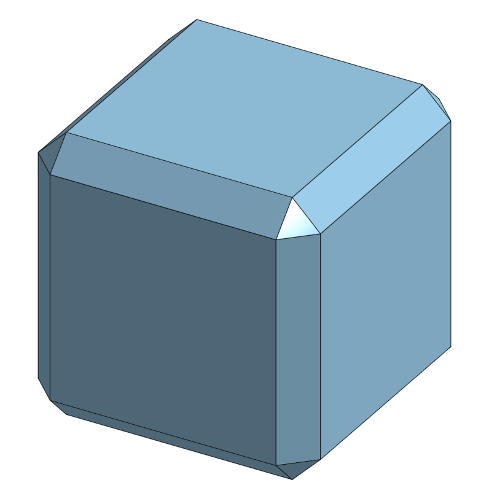

# NavCuve

A helper 3D navigation cube to work with `ThreeJS` camera.

## API

```ts
    let navCubeParams : NavCubeParams = {
      camera: this.camera,
      div: navCubeDiv,
      champer : 0.1,
      homePosition : new THREE.Vector3(-1,-1,1)
    };
    new NavCube(navCubeParams);
```

`div` - pass an HTML div as a parameter, to put the NavCuve their. It is your responsibility to position it and to set the Z-index higher than the ThreeJS canvas.

- Create a new canvas and render there. This is the only way to add rendering stuff w/o having the user add code to his render method.


### Dev



The cube is constructed of

* the main surface faces (front, left, top ...), 
* edge faces (front-left, front-top ...)
* corner faces (front-left-top ...)